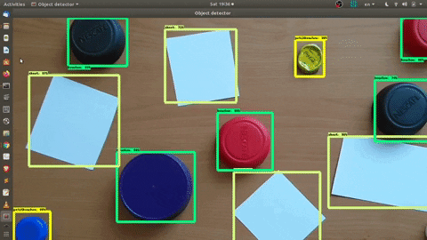
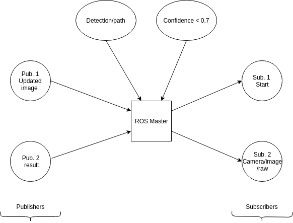
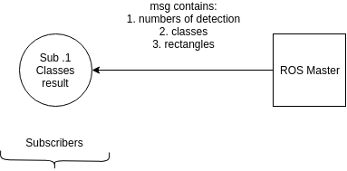
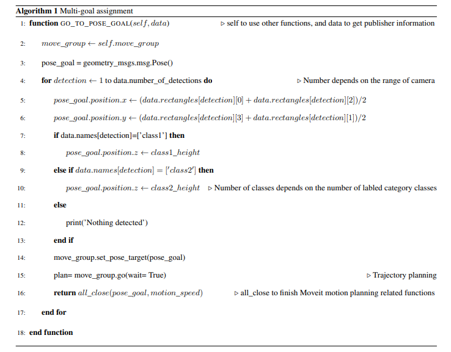

# 1.  Object detection training

The first work that has been done on this project is training an object detector. We trained SSD convolutional network model to detect the objects that can be seen in Figure 1. 

Figure 1. Running the detecion model SSD_mobilenet.

The training was based on Tensorflow object detection API on this [link][1]  

If you want to understand by some detail how training was done, please refer to [our paper][2]

# 2. Camera 

The camera is [Intel RealSense Depth D435][3] which is compatible with ROS. 

# 3.  Robotic motions

You find the ROS code on The _tf_object_detection_node.py_ file, it is responsible for sending the detected regions of the objects to the arm that will use to execute motions (if your robot has inverse kinematics programmed on it, you can use the ROS code for different purposes, in this example ⁠—⁠— I've used it for pick and place as represented in Figure 2)

Figure 2. Pick and place actions. 

## 3.1. Running the first Node
Once you have the node built you can run it with `rosrun tf_object_detection tf_object_detection_node.py`.

Running this node alone will only show the camera window detecting the objects. Having this working means that the detected regions are ready to be sent to the motion node. 

### 3.1.1. Node Information

Topics:

* `camera/image/raw`:  
  Subscribes `sensor_msgs/Image` Image which is used to show the realtime detection that will be sent to the robot.

* `tf_object_detection_node/start`:  
  Subscribes `std_msgs/Empty` Message to command object detection is carried out on the next image

* `tf_object_detection_node/updated_image`:  
  Publishes `sensor_msgs/Image` Adjusted image which may contain bounding boxes and the category classes of the detected objects
  
* `tf_object_detection_node/result`:  
  Publishes `tf_object_detection/detection_results` Contains an array of strings of the detected object names, and the bounding rectangles.

Parameters:

* `/object_detection/path`: the path for models/research/object_detection directory. Default value = /home/ubuntu/git/models/research/object_detection
* `/object_detection/confidence_level`: confidence level(class score), any object with a level below this will not be used. Default value = 0.7 (70%)

The diagram in Figure .3 captures what this node contains.

Figure 3. Object detection node.

## 3.2. Running the Second Node (motion.py)

Running this node is meant to take the predicted regions with their category class from the first node to the robotic arm. Then, this node works with Moveit messages. It basically has the functions necessary to execute the motion given a detected region on the objects (if a robot has inverse kinematics on ROS). 

You can run it with "rosrun tf_object_detection motion.py".

### 3.2.1. Node Information 

* `tf_object_detection/result` topic subscribes to the list of the names of the classes of each detected object, bounding rectangles coordinates, and the number of the detections.

Figure 4. Detection subscriber on the 2nd node.

Other subcribers are associated with [Moveit framework][4].

Because Moveit has a generic architecture that makes it able to move any Arm that was integrated though it using ROS, it is recommended to refer to this Tutorial https://docs.ros.org/kinetic/api/moveit_tutorials/html/index.html in case there are any issues with this particular node. the link includes many tutorials developed on both Python, and C++ that makes you able to choose your best language from them while working with Moveit.

### 3.2.2. Actions execution algorithm 

This must be included on the second node. Why haven't I provided it on the code in the _motion.py_ file? 

Because simply all depends on the placement of the camera for the calibration. The camera coordinates that the camera gives should be converted to the real world coordinates that the robot uses for inverse kinematics. 

 
Figure 5. Actions execution algorthim.

**Important note:** this work is meant to demonstrate that object detection can be used for robotic arms, so the ROS code on this repository can basically be used for any arm its inverse kinematics is developed with ROS. For this purpose, please consider that ROS code of the uArm swift pro that is provided by its company https://github.com/uArm-Developer/RosForSwiftAndSwiftPro is not sufficient —⁠——⁠ it only has forward kinematics, but inverse kinematics was not done there. So if you want a robot that its inverse kinematics is done on ROS, ***you have to avoid the uArm swift pro and look for something else***. On the other hand, uArm swift pro has inverse kinematics done on this Python sdk https://github.com/uArm-Developer/uArm-Python-SDK —⁠——⁠ which is based on _the Arduino only(no ROS)._ 

**Second Note:** we need inverse kinematics not forward kinematics because: the robot is given a position and has to determine the joint angles, ***not the opposite.*** 

***Inverse kinematics*** _is the process of calculating the variable joint parameters needed to place the end of a kinematic chain, such as for a robotic arm, in a given position and orientation relative to the start of the chain._

To get additional information, check our paper on [here][2] (The objects are different)

[1]: https://github.com/tensorflow/models/tree/master/research/object_detection
[2]: irphouse.com/ijert19/ijertv12n11_08.pdf
[3]: https://www.intelrealsense.com/depth-camera-d435/
[4]: https://moveit.ros.org/
